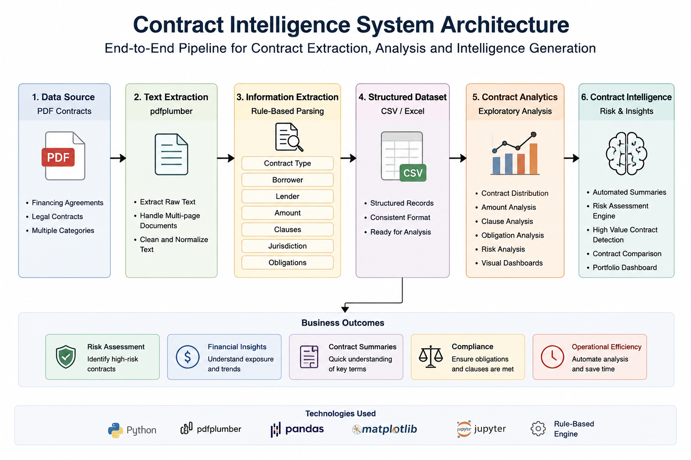
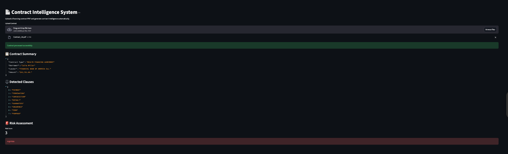
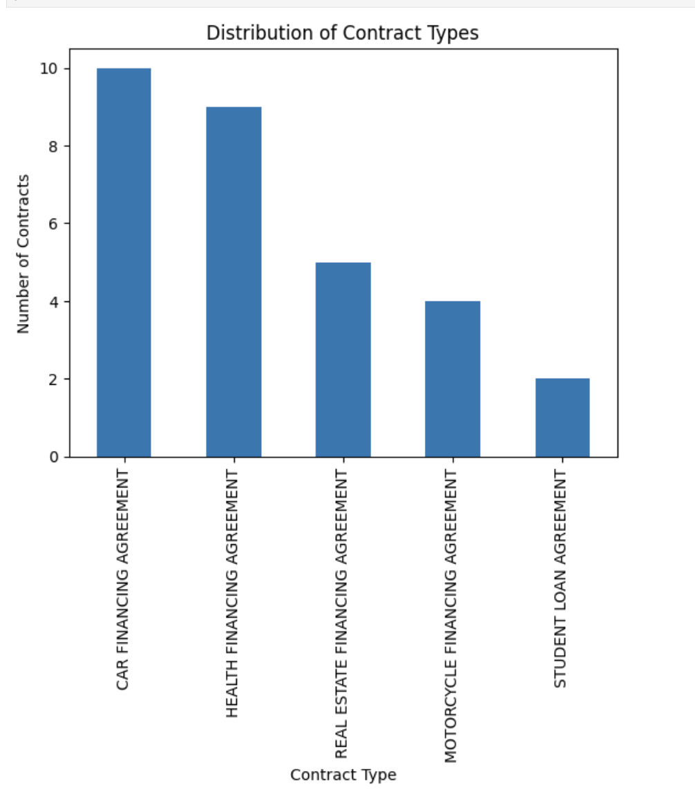
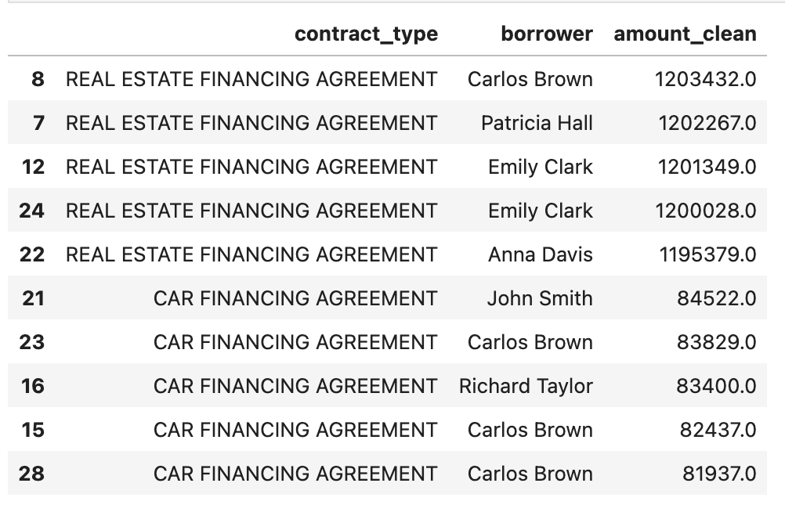

# 📄 Contract Intelligence System

An end-to-end Legal NLP and Contract Analytics platform that transforms unstructured financing agreement PDFs into actionable business intelligence.

The system automatically extracts contract metadata, identifies legal clauses, generates contract summaries, performs risk assessment, classifies legal clauses, and provides an interactive Streamlit application for real-time contract analysis.

---

## 🚀 Features

### Contract Extraction
- PDF text extraction using PDFPlumber
- Borrower identification
- Lender identification
- Financing amount extraction
- Jurisdiction detection
- Clause extraction
- Contract obligation detection

### Contract Analytics
- Contract type distribution analysis
- Borrower analytics
- Financing amount analysis
- Clause frequency analysis
- Obligation frequency analysis
- Exploratory Data Analysis (EDA)

### Contract Intelligence
- Rule-based risk assessment
- Contract intelligence dashboard
- High-value contract identification
- Contract portfolio insights

### Legal NLP
- Clause classification engine
- Legal category mapping
- Contract summarization
- Contract type prediction using Machine Learning

### Streamlit Application
- Upload contract PDFs
- Automated contract processing
- Real-time clause detection
- Risk score generation
- Contract summary generation

---

# 🏗️ System Architecture



---

# 🖥️ Application Demo



---

# 📊 Analytics Dashboard



---

# 🚨 Risk Intelligence Dashboard



---

# 🔄 Project Workflow

```text
Contract PDF
      ↓
PDF Text Extraction
      ↓
Information Extraction
      ↓
Structured Dataset Creation
      ↓
Contract Analytics
      ↓
Clause Classification
      ↓
Contract Summarization
      ↓
Risk Assessment
      ↓
Machine Learning Classification
      ↓
Streamlit Application
```

---

# 📁 Project Structure

```text
contract-intelligence/

├── app/
│   └── app.py
│
├── notebooks/
│   ├── 01_dataset_exploration.ipynb
│   ├── 02_contract_analytics.ipynb
│   ├── 03_contract_intelligence.ipynb
│   ├── 04_clause_classification.ipynb
│   ├── 05_contract_summarization.ipynb
│   └── 06_contract_type_prediction.ipynb
│
├── data/
│   ├── raw-contracts/
│   └── processed/
│
├── assets/
│   ├── architecture_diagram.png
│   ├── app_demo.png
│   ├── analytics_dashboard.png
│   └── intelligence_dashboard.png
│
├── requirements.txt
├── README.md
└── .gitignore
```

---

# 📚 Project Modules

| Notebook | Description |
|-----------|------------|
| 01 Dataset Exploration | Extract structured information from contract PDFs |
| 02 Contract Analytics | Perform exploratory analysis and visualization |
| 03 Contract Intelligence | Generate risk scores and contract intelligence |
| 04 Clause Classification | Categorize clauses into legal domains |
| 05 Contract Summarization | Generate automated contract summaries |
| 06 Contract Type Prediction | Train a machine learning classifier |

---

# 🧠 Machine Learning Pipeline

The machine learning workflow includes:

- Text Feature Engineering
- TF-IDF Vectorization
- Logistic Regression Classification
- Cross Validation
- Automated Contract Type Prediction

Due to the small synthetic dataset and highly standardized contract templates, the notebook serves as a proof-of-concept machine learning pipeline demonstrating legal document classification.

---

# ⚖️ Clause Categories

| Clause | Category |
|----------|----------|
| PURPOSE | General |
| TERM | General |
| PAYMENT | Financial |
| GUARANTEES | Security |
| INSURANCE | Compliance |
| DEFAULT | Risk |
| TERMINATION | Risk |
| JURISDICTION | Legal |

---

# 🛠️ Tech Stack

### Programming
- Python

### Data Processing
- Pandas
- NumPy

### PDF Processing
- PDFPlumber

### Visualization
- Matplotlib

### Machine Learning
- Scikit-Learn
- TF-IDF Vectorization
- Logistic Regression

### Deployment
- Streamlit

### Development Environment
- Jupyter Notebook

---

# ⚙️ Installation

Clone the repository:

```bash
git clone https://github.com/panicAtTheCompile/contract-intelligence.git
cd contract-intelligence
```

Install dependencies:

```bash
pip install -r requirements.txt
```

---

# ▶️ Run the Streamlit Application

```bash
streamlit run app/app.py
```

Open your browser and upload a contract PDF to generate:

- Contract Summary
- Clause Detection
- Risk Assessment
- Contract Intelligence

---

# 📈 Key Outcomes

- Extracted structured information from 30+ financing agreements
- Built a legal clause classification engine
- Developed automated contract summarization workflows
- Implemented contract risk assessment logic
- Created a machine learning pipeline for contract classification
- Deployed an interactive Streamlit application for contract intelligence

---

# 🎯 Future Improvements

- Named Entity Recognition using spaCy
- Transformer-based Legal NLP Models
- Hugging Face Integration
- LangChain Integration
- Retrieval-Augmented Generation (RAG)
- Conversational Contract Chatbot
- Cloud Deployment

---

# 👨‍💻 Author

**Harshita Pulavarti**
 Undergraduate at IIT Kharagpur | AI/ML Enthusiast | Data Science & NLP Projects

GitHub: https://github.com/panicAtTheCompile

---
